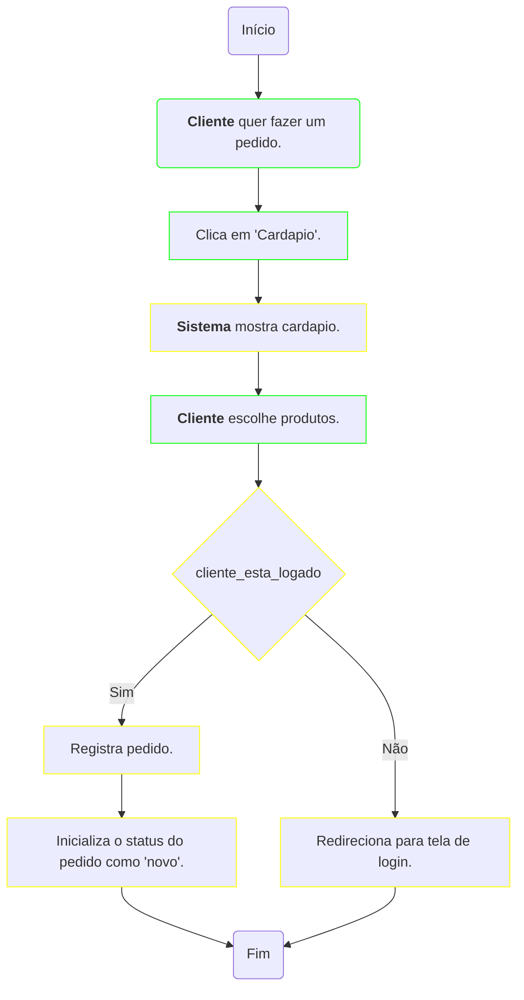

# Sistema de Gerenciamento de Delivery

## Fluxo de cadastro de pedidos

```mermaid
flowchart TD
        inicio("Início");
        cliente_quer_fazer_um_pedido("<b>Cliente</b> quer fazer um pedido."):::cliente;
        clica_em_cardapio["Clica em 'Cardapio'."]:::cliente;
        mostra_cardapio["<b>Sistema</b> mostra cardapio."]:::sistema;
        cliente_escolhe_produtos["<b>Cliente</b> escolhe produtos."]:::cliente;
        cliente_esta_logado{"cliente_esta_logado"}:::sistema;
        redireciona_tela_login["Redireciona para tela de login."]:::sistema;
        fim("Fim");
        registra_pedido["Registra pedido."]:::sistema;
        inicializa_status_novo["Inicializa o status do pedido como 'novo'."]:::sistema;

        inicio --> cliente_quer_fazer_um_pedido;
        cliente_quer_fazer_um_pedido --> clica_em_cardapio;
        clica_em_cardapio --> mostra_cardapio;
        mostra_cardapio --> cliente_escolhe_produtos;
        cliente_escolhe_produtos --> cliente_esta_logado;
        cliente_esta_logado -- Não --> redireciona_tela_login;
        cliente_esta_logado -- Sim --> registra_pedido;
        registra_pedido --> inicializa_status_novo;
        inicializa_status_novo --> fim;
        redireciona_tela_login --> fim;

        classDef cliente stroke:#0f0;
        classDef sistema stroke:#ff0;
```
