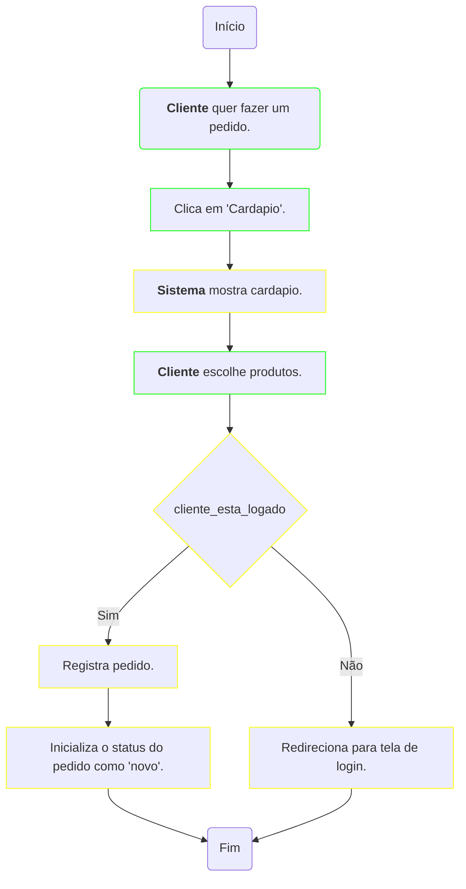

# Sistema de Gerenciamento de Delivery
## Atores do Sistema

Fluxo de cadastro de pedidos

  
## Fluxo de cadastro de pedidos

Fluxo de recebimento de pedidos

## Fluxo de gestão de pedidos (cozinheiro)

```mermaid
flowchart TD
        inicio("Início");
        cozinheiro_quer_ver_pedidos["<b>Cozinheiro</b> quer ver pedidos."]:::cozinheiro;
        clica_aba_pedidos["Clica na aba de pedidos."]:::cozinheiro;
        ver_somente_novos{"Ver somente os pedidos novos?"}:::cozinheiro;
        mostra_novos["<b>Sistema</b> mostra os pedidos novos."]:::sistema;
        ver_somente_em_preparo{"Ver somente os pedidos em preparo?"}:::cozinheiro;
        ver_somente_prontos{"Ver somente os pedidos prontos?"}:::cozinheiro;
        ver_somente_retirados{"Ver somente os pedidos aceitos<br>para a retirada?"}:::cozinheiro;
        ver_somente_rerecusados{"Ver somente os pedidos recusados?"}:::cozinheiro;
        clica_filtro_novo["Clica no filtro 'Novos'"]:::cozinheiro;
        clica_filtro_preparo["Clica no filtro 'Em preparo'"]:::cozinheiro;
        clica_filtro_prontos["Clica no filtro 'Prontos'"]:::cozinheiro;
        clica_filtro_retirados["Clica no filtro 'Retirados'"]:::cozinheiro;
        clica_filtro_recusados["Clica no filtro 'Recusados'"]:::cozinheiro;
        recusar_pedidos{"<b>Cozinheiro</b> quer recusar pedidos?"}:::cozinheiro;
        recusar["Clica em um ou mais pedidos e clica na função 'recusar'"]:::cozinheiro;
        atualiza_recusados["<b>Sistema</b> atualiza os status dos pedidos selecionados para 'Recusado'"]:::sistema;
        preparar_pedidos{"<b>Cozinheiro</b> quer preparar pedidos?"}:::cozinheiro;
        preparar["Clica em um ou mais pedidos e clica na função 'preparar'"]:::cozinheiro;
        atualiza_em_preparo["<b>Sistema</b> atualiza os status dos pedidos selecionados para 'Em preparo'"]:::sistema;
        mostra_em_preparo["<b>Sistema</b> mostra os pedidos 'Em preparo'."]:::sistema;
        marcar_pronto{"Marcar pedidos como 'Pronto'?"}:::cozinheiro;
        pronto["Clica em um ou mais pedidos e clica na função 'Pronto'"]:::cozinheiro;
        atualiza_pronto["<b>Sistema</b> atualiza os status dos pedidos selecionados para 'Pronto'"]:::sistema;
        fim("Fim");
        mostrar_prontos["<b>Sistema</b> mostra os pedidos prontos."]:::sistema;
        mostra_retirados["<b>Sistema</b> mostra os pedidos aceitos para a retirada com o nome do entregador que aceitou."]:::sistema;
        mostra_recusados["<b>Sistema</b> mostra os pedidos recusados."]:::sistema;
        
        inicio --> cozinheiro_quer_ver_pedidos;
        cozinheiro_quer_ver_pedidos --> clica_aba_pedidos;
        clica_aba_pedidos --> ver_somente_novos;
        ver_somente_novos -- Sim --> clica_filtro_novo;
        clica_filtro_novo --> mostra_novos;
        mostra_novos --> recusar_pedidos;
        recusar_pedidos -- Sim --> recusar;
        recusar --> atualiza_recusados;
        atualiza_recusados --> ver_somente_em_preparo;
        recusar_pedidos -- Não --> preparar_pedidos;
        preparar_pedidos -- Sim --> preparar;
        preparar --> atualiza_em_preparo;
        atualiza_em_preparo --> ver_somente_em_preparo;
        clica_filtro_preparo --> mostra_em_preparo;
        mostra_em_preparo --> marcar_pronto;
        marcar_pronto -- Sim --> pronto;
        pronto --> atualiza_pronto;
        atualiza_pronto --> ver_somente_prontos;


        ver_somente_novos -- Não --> ver_somente_em_preparo;
        ver_somente_em_preparo -- Sim --> clica_filtro_preparo;
        ver_somente_em_preparo -- Não --> ver_somente_prontos;
        ver_somente_prontos -- Sim --> clica_filtro_prontos;
        ver_somente_prontos -- Não --> ver_somente_retirados;
        ver_somente_retirados -- Sim --> clica_filtro_retirados;
        ver_somente_retirados -- Não --> ver_somente_rerecusados;
        ver_somente_rerecusados -- Sim --> clica_filtro_recusados;
        ver_somente_rerecusados -- Não --> fim;
        clica_filtro_prontos --> mostrar_prontos;
        mostrar_prontos --> ver_somente_retirados;
        clica_filtro_retirados --> mostra_retirados;
        mostra_retirados --> ver_somente_rerecusados;
        clica_filtro_recusados --> mostra_recusados;
        mostra_recusados --> fim;

        classDef cliente stroke:#0f0;
        classDef sistema stroke:#ff0;
        classDef cozinheiro stroke:#ffa500;
```

